== Operação do sistema

Nesta seção, apresentaremos como acessar o sistema e como funcionam os
botões, listas, filtros de busca e seleções nas páginas do sistema.

=== Acesso ao sistema

Para acessar o sistema, basta abrir o navegador, acessar o endereço na
internet onde o mesmo foi disponibilizado e então informar sua Matrícula
e Senha, fornecida pelo administrador do sistema.

image:imagens/user-docs/user-figura-2-tela-login.png[Tela de login ao
sistema i-Educar]

=== Tela inicial

Na página de entrada podem ser inseridas mensagens aos usuários, como
novidades do sistema ou alertas de manutenção periódica. Existe também
uma opção para recuperar a senha, que enviará um e-mail com instruções
para recuperá-la.

Depois de efetuar o login, serão exibidos os módulos do sistema, que se
subdividem da seguinte forma:

[width="100%",cols="34%,33%,33%",options="header",]
|===
|Módulo |Descrição |Função
|image:imagens/user-docs/user-modulo-enderecamento.png[image]
|Endereçamento |Neste módulo são cadastradas informações de endereços da
instituição, tais como ruas, bairros, CEPs e outros.

|image:imagens/user-docs/user-modulo-pessoas.png[image] |Pessoas |Neste
módulo são cadastradas as pessoas físicas e jurídicas, além dos tipos de
religião, cor ou raça e deficiências, que serão utilizados em pessoas,
alunos e/ou docentes.

|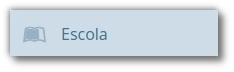 |Escola |Neste
módulo são cadastradas informações das escolas, alunos, matrículas e
outros processos do sistema escolar.

|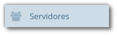 |Servidores
|Neste módulo são cadastradas informações dos servidores, sejam docentes
ou outros tipos de funcionários, além do quadro de horário das turmas.

|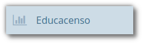 |Educasenso
|Neste módulo você poderá exportar as informações do sistema, para
migrá-las para o ambiente do Educacenso, ou importar o arquivo do Censo
para população de novos dados.

|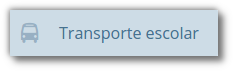
|Transporte Escolar |Neste módulo serão cadastradas informações do
transporte público escolar, assim como outros processos que envolvem o
mesmo.

|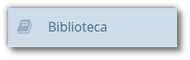 |Biblioteca
|Neste módulo são cadastradas informações das bibliotecas, com registro
de exemplares, empréstimos, devoluções e outros.

|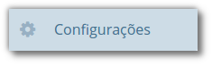
|Configurações |Neste módulo são cadastradas as permissões (tipos de
usuários e cadastro de usuários vinculados), além das ferramentas de
exportação de usuários, backups e auditoria.
|===

Você também poderá pesquisar por qualquer documento ou funcionalidade do
sistema por meio do campo *Busca rápida*, localizada acima dos módulos
descritos anteriormente. Para utilizá-la basta inserir a informação no
campo e selecionar o resultado desejado.

image:imagens/user-docs/user-figura-3-busca-rapida.png[Campo de Busca
Rápida com lista pré-carregada para serem selecionadas]

=== Comportamento das listas e botões

Quando um cadastro é aberto uma listagem de registros é exibida, e ao
clicar em um destes registros é aberta uma nova página com opções
específicas para este registro.

image:imagens/user-docs/user-figura-4-listagem-registros-alunos.png[Exemplo
de lista de alunos organizada em tabela com quatro colunas: Código do
Aluno, Nome do Aluno, Nome da Mãe e Nome do Responsável, seguido de suas
informações]

Quando uma página não comporta a listagem de todos os registros, os
botões de navegação entre as várias páginas de registros são
habilitados. A função de cada um destes botões é descrita a seguir:

[width="100%",cols="34%,33%,33%",options="header",]
|===
|Componente |Descrição |Como funciona?
|image:imagens/user-docs/user-componente-numeros-paginas.png[Sequência de
números representando a paginação de uma listagem] |Selecionar página de
navegação |Este botão exibe atalhos para 7 (sete) páginas de listagem de
registros mais próximas. Um clique em um número x do botão leva
diretamente para a esta página x de registros.

|image:imagens/user-docs/user-componente-proxima-pagina.png[Sinal
matemático de “maior” representando a indicação para próxima página]
|Avançar página |Este botão exibe a próxima página de listagem de
registros.

|image:imagens/user-docs/user-componente-voltar-pagina.png[Sinal
matemático de “menor” representando indicação para voltar página]
|Voltar página |Este botão exibe a página anterior de listagem de
registros.

|image:imagens/user-docs/user-componente-ultima-pagina.png[Duplo sinal
matemático de “maior” representando indicação para última página]
|Última página |Este botão exibe a última página de listagem de
registros.

|image:imagens/user-docs/user-componente-primeira-pagina.png[Duplo sinal
matemático de “menor” representando indicação para primeira página]
|Primeira página |Este botão exibe a primeira página de listagem de
registros.
|===

As opções de um registro podem variar conforme o cadastro. Na Figura 5
são ilustrados os botões exibidos quando é realizado um clique em um
item de registro da listagem de alunos. Os botões *Novo*, *Editar* e
*Voltar* são comuns em todos os cadastros. No caso dos botões *Nova
matrícula*, *Atualizar histórico* e *Distribuição de uniforme* são
específicos do cadastro de Alunos.

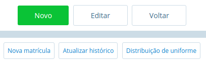

Ao pressionar o botão *Novo*, uma página para a inserção de um novo
registro é aberta, e neste caso, surgem os botões *Salvar*, que ao ser
pressionado, gravará os dados no banco de dados e o *Cancelar*,
descartará os dados informados e retornará para a listagem de registros
ilustrada na Figura 4.

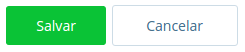

Ao pressionar o botão *Editar*, uma página similar à de inserção de
novos registros é carregada para que seja possível alterar informações
do cadastro. Ao pressionar o botão *Salvar*, as alterações realizadas
são gravadas no banco de dados e o *Cancelar*, descarta qualquer
alteração feita e retorna para a listagem de registros ilustrada na
Figura 4.

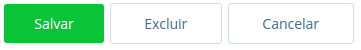

NOTE: O botão *Excluir* permite que o registro seja excluído
definitivamente do banco de dados. Para garantir a integridade do banco
de dados, alguns cadastros não exibem este botão.

Além dos botões supracitados, outros componentes de página podem ser
apresentados nos cadastros, tais quais são descritos a seguir:

[width="100%",cols="34%,33%,33%",options="header",]
|===
|Componente |Descrição |Como funciona?
|image:imagens/user-docs/user-componente-adicionar.png[Botão adicionar
itens no cadastro] |Adicionar |Adicionar itens em um cadastro. É exibido
ao lado ou abaixo de uma lista de seleção e primeiro deve ser
selecionado o item na lista, para posteriormente pressionar o botão.

|image:imagens/user-docs/user-componente-adicionar-novo.png[Botão
adicionar novos itens no cadastrado] |Adicionar Novo |Adiciona novas
linhas para a inclusão de novos itens em um cadastro. Diferentemente do
anterior, os itens da lista são selecionados depois de se pressionar o
botão.

|image:imagens/user-docs/user-componente-editar.png[Botão com ícone de
caderno com lápis representando edição de itens] |Inserir/Editar
|Inserir itens em um cadastro. Ex: ao cadastrar uma escola, se clicar
neste botão ao lado do campo Rede Ensino, abrirá o cadastro de Rede de
Ensino, e ao Salvar, transfere automaticamente o que foi cadastrado para
o campo Rede Ensino.

|image:imagens/user-docs/user-componente-excluir-textual.png[Botão
excluir itens no cadastro] |Excluir |Excluir itens em um cadastro. São
exibidos ao lado de itens adicionados anteriormente.

|image:imagens/user-docs/user-componente-excluir-botao.png[Botão excluir
itens no cadastro] |Excluir |Mesmas funções do Excluir citado
anteriormente, porém com um ícone diferente.

|image:imagens/user-docs/user-componente-buscar.png[Botão com ícone de
lupa representando busca de itens] |Buscar |Busca itens de um outro
cadastro. Quando um campo possuir esta lupa ao lado, ao pressioná-la
abrirá uma janela para pesquisar registros de outro cadastro.
|===

=== Filtros de busca e seleção

Quando os cadastros são abertos, na parte inferior da página são
exibidos campos que podem ser usados para filtrar os registros da
listagem.

image:imagens/user-docs/user-figura-8-campos-filtros-cadastro-alunos.png[Formulário
para busca de alunos com campos “Código Aluno”, “Código INEP”,
“Código rede estadual do aluno (RA)”, “Nome do aluno”, “Data de
Nascimento”, “Nome do Pai”, “Nome da Mãe”, “Nome do Responsável”]

Com os filtros de busca é possível, por exemplo, buscar todos os alunos
com uma _data de nascimento_ específica. Para isto, basta informar a
data no campo *Data de Nascimento* e pressionar o botão *Buscar* ou o
botão *Enter* do seu teclado.

Um componente que os filtros de busca podem exibir é a busca rápida.
Neste componente o usuário pode digitar o _nome_, ou outra referência
que esteja descrita no campo, e o mesmo mostrará uma listagem que contém
as informações que foram digitadas, como mostra a imagem abaixo:

image:imagens/user-docs/user-figura-9-busca-rapida.png[Formulário para
busca de alunos com campos “Instituição”, “Escola” e “Modelo” já
preenchidos, aguardando campo “Aluno” ser preenchido]

Filtros de seleção são utilizados normalmente para a emissão de
relatórios ou exportações de arquivos. Na Figura 10, pode ser
visualizado um exemplo de filtro de um documento de _Atestado de Vaga_.
Os campos são alimentados com valores diferentes à medida que o usuário
modifica a seleção, exemplo: ao selecionar uma _Instituição_, o campo
_Escola_ será alimentado com todas as escolas desta instituição; depois
de selecionar a escola, no campo _Curso_ serão listados todos os cursos
disponíveis para esta escola, e assim sucessivamente. O botão *Exibir*
serve para processar o relatório.

image:imagens/user-docs/user-figura-10-formulario-emissao-relatorio-atestado-vaga.png[Formulário
para processamento de atestado de vaga com campos “Emitir em branco”,
“Ano”, “Instituição”, “Escola”, “Curso”, “Série”, “Aluno”,
“Documentos obrigatórios”, “Emitir assinatura do gestor escolar”,
“Emitir assinatura do secretário escolar” e “Emitir a data de
validade do documento”, com botão “Exibir” abaixo]

Filtros de seleção podem exibir ainda outro componente: a lupa. Neste
caso, o usuário poderá buscar um respectivo dado cadastrado a partir de
um clique na lupa, que faz com que a janela Pesquisa de valores seja
aberta exibindo componentes de filtragem similares ao demonstrado na
Figura 8.

NOTE: O componente lupa é genérico, e poderá ser exibido em outras
áreas do sistema como forma de auxílio ao preenchimento de campos de
outros cadastros.

=== Módulo Endereçamento e Pessoas

Apresentação dos módulos de endereçamento e pessoas físicas e jurídicas,
além dos tipos deficiência, cor ou raça e religião.

=== Módulo Endereçamento

No módulo *Endereçamento* devem ser inseridas as informações dos
_bairros_, _logradouros_ e _CEPs_ da instituição para que possam ser
utilizados no cadastro de pessoas, alunos, escolas e outros. Para
acessar o mesmo, basta clicar em *Endereçamento* apresentado na barra de
módulos do sistema.

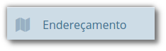

=== Módulo Pessoas

No módulo você pode inserir as informações das _pessoas físicas e
jurídicas_ que serão trabalhadas dentro do sistema. Estas pessoas
incluem escolas, professores, pais, alunos dentro outros, que depois de
registrados no sistema, passa a fazer parte de um cadastro único.

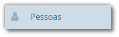

Além do cadastramento das pessoas físicas e jurídicas, ainda é possível
no módulo Pessoas, registrar os tipos de deficiência e tipos de cor ou
raça, informações importantes na fase de coleta de dados do Censo
escolar.

==== Tipos de deficiência e cor ou raça

No cadastro de *Tipos de deficiência* você poderá cadastrar as
deficiências que posteriormente podem ser informadas para alunos e
professores. Exemplos de deficiências: _Física_, _Visual_, _Auditiva_,
_etc_.

Os tipos de deficiências são pré-cadastrados com base nos tipos
definidos nacionalmente pelo Censo Escolar, conforme disponibilizado em
tabela.

____
*Localização:* Módulo Pessoas > Cadastros > Tipos > Tipos de deficiência
____

image:imagens/user-docs/user-figura-13-tipos-deficiencia.png[Lista de
deficiências com itens “Altas Habilidades/Superdotação”, “Autismo
Clássico”, “Baixa Visão”]

O cadastro de *Tipos de cor ou raça*, também apresentado no módulo
*Pessoas*, é responsável pelo cadastramento dos tipos de cor ou raça que
serão utilizados no sistema, e assim como em *Tipos de deficiências*, é
relacionado com os tipos nacionais identificados pelo *Censo escolar*.

____
*Localização:* Módulo Pessoas > Cadastros > Tipos > Tipos de cor ou raça
____

image:imagens/user-docs/user-figura-14-listagem-raca.png[Lista de raças
com itens “Amarela”, “Branca”, “Indigena”, “Não Declarada”,
“Parda” e “Preta”]

IMPORTANT: Os cadastros de *Tipos de deficiência* e *Tipos de cor ou
raça*, são informações importantes para o *Censo escolar*, portanto, é
necessário manter os mesmos atualizados, com o vínculo correto, para que
todos os alunos e docentes do sistema apresentem a informação correta
durante a coleta.

=== Cadastros do Sistema Educacional

Seção para aprensetar todos os cadastros do módulo _Escola_, como o
cadastro de cursos e séries, e dos próprios alunos, sendo o principal
cadastro do sistema.

=== Tipos de Ocorrências disciplinares, Transferências e Abandono

No cadastro de *Tipos de ocorrências disciplinares*, você poderá
cadastrar os tipos de ocorrências disciplinares que podem ser informadas
para os alunos. Exemplos: _Desrespeito aos professores_, _Advertência_,
_etc_.

____
*Localização:* Módulo Escola > Cadastros > Tipos > Matrículas > Tipos de
ocorrências disciplinares
____

image:imagens/user-docs/user-figura-15-tipos-ocorrencias-disciplinares.png[Formulário
para editar tipos de ocorrências disciplinares com os campos “Instituição”, “Tipo
de Ocorrência Disciplinar”, “Descrição” e
“Máximo Ocorrências”, com botões “Salvar”, “Excluir” e
“Cancelar”]

Neste cadastro, é possível informar o número máximo de ocorrências, o
que significa que quando algum aluno atingir o máximo de ocorrências
poderá ser emitido algum aviso aos responsáveis pelo aluno.

No cadastro de *Tipos de transferências* você poderá cadastrar os tipos
de transferências que serão usadas posteriormente ao realizar a
transferência de um aluno. Exemplos de tipos de transferências: _Mudança
de endereço_, _Troca de turma_, _etc_.

____
*Localização:* Módulo Escola > Cadastros > Tipos > Matrículas > Tipos de
transferência
____

image:imagens/user-docs/user-figura-16-tipos-transferencia.png[Formulário
para editar tipos de transferẽncias com os campos “Instituição”,
“Motivo Transferẽncia” e “Descrição”, com os botões “Salvar”,
“Excluir” e “Cancelar”]

E por fim, o cadastro de *Tipos de abandono* você poderá cadastrar os
tipos de abandono que também serão utilizados posteriormente ao
registrar o abandono do aluno. Exemplos de tipo de abandono:
_Desistência_, _Falecimento_, _etc_.

____
*Localização:* Módulo Escola > Cadastros > Tipos > Matrículas > Tipos de
abandono
____

image:imagens/user-docs/user-figura-17-cadastro-desistencia.png[Formulário
para cadastro de desistência com campos “Instituição” e “Motivo
Abandono”, com botões “Salvar” e “Cancelar”]

=== Instituição

Neste cadastro você poderá cadastrar as instituições responsáveis pelas
escolas da rede de ensino, além de inserir parâmetros e dados
específicos da mesma, tanto para controle de datas quanto de
funcionalidades.

____
*Localização:* Módulo Escola > Cadastros > Instituição
____

No cadastro de instituições ainda é possível definir uma série de
documentações padrões, que permitirão ao município inserir documentos
próprios e que não são contemplados pelos relatórios/documentos que o
sistema dispõe. Para acessar a funcionalidade, basta selecionar uma
instituição na listagem e clicar no botão *Documentação padrão*.

Na nova tela, você deverá definir um título para o respectivo documento
e anexá-lo por meio do botão *Escolha um arquivo*, por fim, o sistema
irá carregar o documento e apresentá-lo abaixo com as opções de exclusão
e visualização, conforme exemplo da Figura 18.

image:imagens/user-docs/user-figura-18-documentos-padroes.png[Formulário
para inserção de documentação padrão com campos “Título” e
“Documentação Padrão”, opções para exclusão e visualização de “Lista
de Materiais” e “Termo de Contrato”, com botões “Salvar” e
“Voltar”]

Para que o usuário possa emitir estes documentos, basta ele acessar o
módulo *Escola em Documentos > Documentação padrão*.

TIP: É importante anexar arquivos que apresentem uma boa qualidade.
Lembrando que serão aceitos somente arquivos no formato *pdf* com até
*2MB* quanto ao tamanho.

=== Cursos

Neste cadastro você poderá cadastrar os cursos oferecidos pela
instituição de ensino. Entretanto, antes de iniciar o cadastramento dos
cursos, é importante cadastrar os *Tipo de regime*, *de nível de
ensino*, *do próprio ensino* e as *habilitações* (módulo Escola >
Cadastros > Tipos > Cursos), sendo que estas informações são preenchidas
ao cadastrar um curso.

____
*Localização:* Módulo Escola > Cadastros > Cursos
____

image:imagens/user-docs/user-figura-19-curso-cadastrado.png[Lista de
detalhes de curso com os campos “Instituição”, “Nível Ensino”,
“Tipo Ensino”, “Curso”, “Quantidade Etapas”, “Hora/Falta”,
“Carga Horária” e “Padrão Ano Escolar”, com botões “Novo”,
“Editar” e “Voltar”]

As principais opções do cadastro de cursos são detalhadas a seguir:

[width="100%",cols="50%,50%",options="header",]
|===
|Opção |Como funciona?
|Quantidade Etapas |Esta informação define a quantidade de anos
escolares do curso. No exemplo da Figura 19 é um curso de Educação
Infantil.

|Hora/Falta |Nesta opção deve ser informado um valor decimal equivalente
a 01 (uma) hora falta. Ex: se as aulas são de 50 minutos, neste campo
deverá ser informado o valor 0,83.

|Carga Horária |Nesta opção deve ser informada a quantidade de horas
total do curso para todas as etapas informadas.

|Padrão Ano Escolar |Caso esta opção seja marcada, a quantidade de
módulos de uma etapa (série ou ano) do curso será definida pelo ano
letivo da escola, caso contrário, os módulos terão de ser informados
individualmente por turma. O primeiro caso é o mais comum.
|===

=== Escolas

Neste cadastro você poderá cadastrar todas as escolas da rede municipal
de ensino. Entretanto, antes de iniciar o cadastramento das escolas, é
importante cadastrar o *Tipo de localização* e o *Tipo de rede de
ensino* (módulo Escola > Cadastros > Tipos > Escolas), sendo que estas
informações são preenchidas ao cadastrar uma escola.

____
*Localização:* Módulo Escola > Cadastros > Escolas
____

image:imagens/user-docs/user-figura-20-detalhes-escola-cadastrada.png[Lista
de detalhes de uma escola cadastrada com os campos “Instituição”,
“Escola”, “Sigla”, “Localização”, “CEP”, “Bairro”, “Tipo
Logradouro”, “Logradouro”, “Complemento”, “Telefone”, “Curso”,
informações condensadas de anos letivos, com opções “Iniciar”,
“Finalizar” e “Editar”]

As principais opções e/ou componentes do cadastro de escolas são
detalhadas a seguir:

[width="100%",cols="34%,33%,33%",options="header",]
|===
|Componente |Descrição |Como funciona?
|image:imagens/user-docs/user-componente-iniciar-ano-letivo.png[Botão
iniciar ano letivo] |Iniciar ano letivo |Ao pressionar este botão, o ano
letivo da escola será iniciado.

|image:imagens/user-docs/user-componente-editar-ano-letivo.png[Botão
editar ano letivo] |Editar ano letivo |Ao pressionar este botão, será
aberto outro cadastro para serem informados os módulos do ano letivo.
(Veja mais detalhes no Capítulo VII).

|image:imagens/user-docs/user-componente-finalizar-ano-letivo.png[Botão
finalizar ano letivo] |Finalizar ano letivo |Ao pressionar este botão, o
ano letivo da escola será finalizado. Deve-se notar que é permitido
finalizar um ano letivo desde que não exista mais nenhuma matrícula em
andamento no ano.

|image:imagens/user-docs/user-componente-reabrir-ano-letivo.png[Botão
reabrir ano letivo] |Reabrir ano letivo |Ao pressionar este botão, o ano
letivo já encerrado será reaberto, possibilitando editar e criar novos
dados no mesmo.

|— Ano Finalizado — |Ano Finalizado |Esta informação é exibida após ter
sido pressionar o botão *Finalizar Ano Letivo*.
|===

Quando um ano letivo é iniciado, o sistema realiza uma cópia das turmas
que foram cadastradas para o ano letivo que será iniciado. Sendo assim,
as turmas serão duplicadas no cadastro de turmas, sendo necessário
renomear as turmas que farão parte do novo ano letivo.

=== Alunos

Neste cadastro você poderá cadastrar novos alunos, controlar seus dados,
responsáveis, deficiências, benefícios e outras informações.

____
*Localização:* Módulo Escola > Cadastros > Alunos
____

image:imagens/user-docs/user-figura-21-parcial-cadastro-aluno.png[Lista
de informações parciais de cadastro de aluno no modo edição com os
campos “Foto”, “Código aluno”, “Código INEP”, “Código rede
estadual”, “Código Sistema”, “Pessoa”, “Data de nascimento”, “RG
/ Data emissão”, “CPF”, “Justificativa para a falta de
documentação” e “Tipo certidão civil”]

Ao selecionar a opção Cadastrar Pessoa ou Editar pessoa, se estiver
editando um aluno, uma janela de cadastro rápido será aberta, como
mostra a Figura 22. Você deverá preencher os _Dados Básicos_ e os _Dados
do endereço_ do aluno.

Caso não consiga localizar os dados de endereço na busca (lupa ou
digitando diretamente o CEP), você poderá cadastrar um novo endereço
usando as opções disponíveis para isto, como mostra a Figura 22.

Após ter alterado ou informado os dados para um novo aluno, pressione o
botão *Gravar* e será exibida novamente uma tela similar a apresentada
na Figura 21.

image:imagens/user-docs/user-figura-22-cadastro-rapido-aluno.png[Formulário
para cadastro rápido de alunos com abas “Ficha médica”, “Moradia”,
“Recursos prova INEP” e “Projetos”, com os campos “Nome”,
Sexo“,”Estado civil“,”Data de
nascimento“,”Telefone“,”Celular“,”Naturalidade“,”Dados do
endereço“,”CEP“,”Município“,”Distrito“,”Logradouro“,”Bairro“,”Complemento“,”Número“,”Letra“,”Número
do apartamento“,”Bloco" e “Andar”]

O mesmo processo realizado para o aluno poderá ser realizado para o Pai
e Mãe do aluno, entretanto, diferentemente do cadastro/edição do nome do
aluno, a janela exibirá menos informações. Caso desejar informar mais
detalhes, selecione a opção Cadastro detalhado, como mostra a Figura 23.

image:imagens/user-docs/user-figura-23-pai-mae-rapido.png[Formulário para
cadastro rápido de pai ou mãe com os campos “Nome”, “Sexo”, “Estado
civil”, “Data de nascimento”, “Falecido”, com opção “Cadastro
detalhado”, botões “Gravar” e “Cancelar”]

Quando a opção de cadastro detalhado for selecionada, uma outra página
de cadastro com informações mais detalhadas ira abrir em uma nova aba ou
janela do navegador. Ao preencher as informações desejadas e pressionar
o botão *Gravar* a aba ou janela será automaticamente fechada e
retornará para a tela de cadastro do aluno, com as informações
atualizadas.

Além destas informações básicas apresentadas acima, podemos cadastrar
outras informações no cadastro de alunos, conforme demonstrado a seguir:

[width="100%",cols="50%,50%",options="header",]
|===
|Aba |Como funciona?
|Dados pessoais |Nesta aba serão cadastradas todas as informações
pessoais do aluno, como pais, responsáveis, data de nascimento, dentre
outros campos.

|Ficha médica |Nesta aba serão cadastradas todas as informações
referentes a ficha médica do aluno, como peso, altura, se já teve algum
tipo de doença, dentre outros campos.

|Moradia |Nesta aba serão cadastradas todas as informações referentes a
moradia do aluno, principalmente o tipo de situação do mesmo.

|Recurso prova INEP |Nesta aba serão cadastradas todas as informações
referentes ao recursos da prova INEP para coleta de dados no período do
Censo escolar.

|Projetos |Nesta aba serão cadastradas as informações referentes aos
projetos que o aluno participa, principalmente as datas de início e
término do mesmo.

|Uniforme escolar |Nesta aba serão cadastradas todas as informações
referentes ao uniforme escolar do aluno, como por exemplo o tamanho das
peças.
|===

NOTE: As abas de _Ficha Médica_, _Moradia_, _Recursos prova INEP_,
_Projetos_ e _Uniforme escolar_ no cadastro de alunos, não são
obrigatórias, servem somente para complemento e detalhamento do cadastro
do mesmo. A obrigatoriedade aplica-se somente aos _Dados Pessoais_ do
aluno.

O sistema também traz a inovação de gravar fotos no cadastro dos alunos,
que poderão ser visualizadas tanto nos cadastros quanto em relatórios. O
procedimento de inserção da imagem pode ser efetuado tanto no cadastro
da _Pessoa Física_ quanto em _Alunos_.

Para cadastrar uma foto, use a opção *Escolha um arquivo*, selecione o
arquivo de foto desejado e confirme. Após gravar, o resultado será
similar ao apresentado na Figura 24, tanto em modo cadastro em Pessoa
Física quanto na exibição/edição no cadastro de alunos.

image:imagens/user-docs/user-figura-24-edicao-foto-aluno-pessoa-fisica.png[Formulário
para alteração de foto de aluno com exibição de foto atual de exemplo,
com os campos “Foto atual”, “Excluir a foto” e “Trocar foto”, com
botão “Escolha um arquivo”]

NOTE: Recomenda-se o uso de imagens nos formatos *jpg*, *jpeg*, *png*
e *gif*, com tamanho máximo de *150KB*, garantindo assim qualidade de
imagem e alta performance no upload e exibição da foto.

TIP: Com a funcionalidade de fotos e a utilização de uma webcam, é
possível coletar fotos para todos os alunos da escola e assim ter um
cadastro ainda mais completo na rede de ensino.

==== Unificação de alunos

Embora o sistema possua diversas verificação para evitar a duplicidade
de dados, como o CPF e código INEP do aluno, em alguns casos pode
ocorrer em que os campos utilizados para verificação não foram
informados, ou preenchidos de forma incorreta, e portanto, ao não
efetuar a busca do aluno antes da criação, acaba por resultar em um
cadastro duplicado.

Entretanto, para que o usuário possua autonomia de corrigir estes dados,
sem ter que excluir os alunos duplicados e reinserir as informações no
aluno correto, existe a funcionalidade de *Unificação de alunos*,
conforme Figura 25.

____
*Localização:* Módulo Escola > Ferramentas > Unificações > Unificação de
alunos
____

image:imagens/user-docs/user-figura-25-unificando-aluno-duplicado.png[Formulário
para unificiação de alunos duplicados com os campos “Ano”,
“Instituição”, “Escola”, “Aluno principal”, “Aluno duplicado”
com a identificação dele, opções de “Excluir referência de aluno
duplicado” e “Adicionar Novo”, botão “Unificar”]

Na tela de unificação, o usuário deverá preencher o campo *Aluno
principal* com o aluno que será mantido no sistema, pesquisando por nome
ou código, e na tabela *Aluno duplicado*, inserir todos os demais
cadastros do respectivo aluno, para unificação dos dados. Ao clicar no
botão *Salvar*, todas as matrículas e históricos dos cadastros
duplicados serão migradas para o aluno definido como principal,
excluindo os demais registros.

=== Componentes curriculares

Neste cadastro você poderá cadastrar as disciplinas que poderão ser
lecionadas na rede de ensino. Antes de iniciar o cadastramento dos
componentes curriculares, é importante cadastrar as *Áreas de
conhecimento* e os *Tipos de dispensa de disciplina*, sendo que os
cadastros das áreas de conhecimento serão informados ao cadastrar as
disciplinas e os tipos de dispensa na matrícula do aluno. O processo de
matrícula de alunos será visto nos próximos capítulos.

____
*Localização:* Módulo Escola > Cadastros > Componentes curriculares
____

image:imagens/user-docs/user-figura-26-editar-disciplina-componente-curricular.png[Formulário
para edição de disciplina no cadastro de componentes curriculares, com
os campos “Instituição”, “Nome”, “Nome abreviado”, “Base
curricular”, “Áreas conhecimento”, “Disciplina Educasenso” e
“Ordem de apresentação”, botões “Salvar” e “Cancelar”]

O cadastro de *Tipos de dispensa* permite cadastrar motivos pelos quais
determinados alunos podem ser dispensados de uma disciplina. No
cadastro, basta informar uma descrição e no processo de matrícula, que
será explicado em breve, poderá ser utilizada a opção *Dispensa de
componentes curriculares* para dispensar um aluno, por um destes motivos
pré-cadastrados, de uma determinada disciplina.

____
*Localização:* Módulo Escola > Cadastros > Tipos > Componentes
curriculares > Tipos de dispensa
____

== Séries e configuração dos Anos Escolares

No cadastro *Séries* você poderá cadastrar todas as séries – ou anos
escolares – de cada curso da instituição. As séries/anos específicas das
escolas serão vistas em seguida, no cadastro *Séries da escola*.

____
*Localização:* Módulo Escola > Cadastros > Séries
____

image:imagens/user-docs/user-figura-27-editando-ano-escolar-cadastro-series.png[Formulário
para edição de ano escolar no cadastro de séries, com os campos
“Instituição”, “Curso”, “Série”, “Etapa Curso”, “Regra de
avaliação”, “Regra de avaliação diferenciada”, “Concluente”,
“Carga Horária”, “Dias letivos”, “Idade padrão”, “Faixa etária”
e “Observação histórico”, opções “Exibir alerta ao tentar matricular
alunos fora da faixa etária da série/ano”, “Bloquear matrículas de
alunos fora da faixa etária da série/ano” e “Exigir INEP para a
matrícula”, botões “Salvar”, “Excluir” e “Cancelar”]

As principais opções do cadastro de séries/anos são detalhadas a seguir:

[width="100%",cols="50%,50%",options="header",]
|===
|Opção |Como funciona?
|Etapa curso |Nesta opção deve ser informada a etapa do curso
correspondente a série/ano que se está cadastrando.

|Regra avaliação |Nesta opção deve ser informada a regra de avaliação
que será utilizada para esta série/ano. O assunto regras de avaliação
será visto nos próximos capítulos.

|Regra de avaliação diferenciada |Esta informação será preenchida
somente quando o parâmetro `__Utilizar regra de avaliação
diferenciada__' estiver marcado no cadastro das escolas, e neste caso
irá utilizar uma regra diferente da geral.

|Carga horária |Nesta opção deve ser informada a carga horária total da
série/ano, informação que posteriormente é utilizada para verificar a
frequência do aluno.
|===

Depois de cadastradas as séries/anos padrões do curso, deverão ser
configurados os anos escolares, procedimento o qual definirá para quais
séries/anos escolares determinada disciplina estará disponível.

Ao acessar uma disciplina da listagem, exibirá um botão chamado
*Configurar anos escolares*, e ao pressioná-lo, será aberto o modo de
edição conforme ilustrado na Figura 28.

image:imagens/user-docs/user-figura-28-editar-anos-escolas-disciplina-matematica.png[Formulário
para editar anos escolas na disciplina de matemática, com os campos
“Ensino Fundamental de 9 anos”, incluindo a carga horária para cada
ano, por exemplo “Primeiro ano”, “Segundo ano” e assim por diante]

No cadastro de *Séries da escola* você poderá cadastrar todas as séries
de uma escola, a qual herda as informações do cadastro de séries/anos
padrões da instituição, mas podendo também definir configurações
específicas da escola.

____
*Localização:* Módulo Escola > Cadastros > Séries da escola
____

image:imagens/user-docs/user-figura-29-editar-ano-escolar-series-escola.png[Formulário
para edição de ano escolar no cadastro de séries da escola, com os
campos “Instituição”, “Escola”, “Curso”, “Série”, “Hora
Inicial”, “Hora Final”, “Hora Início Intervalo” e “Hora Fim
Intervalo”, com opções “Bloquear enturmação após atingir limite de
vagas”, “Bloquear cadastro de novas turmas antes de atingir limite de
vagas (no mesmo turno)”]

As principais opções encontradas no cadastro de Séries da escola estão
detalhadas a seguir:

[width="100%",cols="50%,50%",options="header",]
|===
|Opção |Como funciona?
|Nome |Nesta opção serão listadas todas as disciplinas padrão para a
série/ano da instituição, sendo que é possível definir quais estarão
disponíveis para a série/ano da escola.

|Carga horária |Nesta opção poderá ser informada uma carga horária para
a escola diferente do padrão da série/ano da instituição.

|Usa padrão do componente |Esta opção sempre estará marcada, e informa
ao sistema que a série/ano da escola utiliza a carga horária padrão da
instituição. Caso algum valor tenha sido informado no campo Carga
horária, esta opção deve ser desmarcada.

|Bloquear enturmação após atingir limite de vagas |Ao marcar esta opção,
quando atingir o limite de vagas que é definido na turma, não será mais
possível fazer enturmações.

|Bloquear cadastro de novas turmas antes de atingir limite de vagas (no
mesmo turno) |Ao marcar esta opção, não será possível cadastrar novas
turmas até que o limite de vagas da turma for atingido. Neste caso, em
uma turma matutina que suporta 25 alunos, não será possível criar outra
turma matutina até que as 25 vagas estejam preenchidas.
|===

== Infraestrutura

No cadastro *Infraestrutura* você poderá cadastrar todas as informações
referentes aos prédios, blocos, tipos de cômodos e os cômodos
propriamente dito, de todas as escolas da rede de ensino.

____
*Localização:* Módulo Escola > Cadastros > Infraestrutura
____

image:imagens/user-docs/user-figura-30-editar-dados-comodo.png[Formulário
para editar dados de um cômodo, com os campos “Instituição”,
“Escola”, “Prédio”, “Tipo de ambiente”, “Ambiente”, “Área m²”
e “Descrição do ambiente”, com os botões “Salvar” e “Cancelar”]

Em *Cadastros > Tipos > Infraestrutura* é possível ainda cadastrar os
prédios, funções dos ambientes do prédio e os próprios ambientes. Estes
cadastros são detalhados a seguir:

[width="100%",cols="50%,50%",options="header",]
|===
|Submenu |Como funciona?
|Prédios |Neste cadastro, você pode informar os dados cadastrais e de
localização dos edifícios e/ou instalações de cada escola.

|Tipo de ambiente |Neste cadastro, você poderá definir as funções dos
ambiente dos prédios; Ex. Sala de aula, Sala de reuniões, Laboratório de
Informática, etc.

|Ambiente |O campo ambiente é informado no próprio cadastro de
Infraestrutura, e nele você poderá cadastrar os ambientes propriamente
ditos, informando as descrições dos mesmos, assim como localização e
área ocupada no prédio. Um exemplo pode ser visto na Figura 29, como
`Sala 01'.
|===

=== Turmas

Neste cadastro você poderá informar os dados das turmas do ano letivo
corrente, qual sua localização na escola, professor regente, capacidade
de alunos e também os horários das aulas, caso estes sejam diferentes
dos períodos da série/ano.

____
*Localização:* Módulo Escola > Cadastros > Turmas
____

image:imagens/user-docs/user-figura-31-editar-cadastro-turmas.png[Formulário
de edição de turmas, com os campos “Instituição”, “Escola”,
“Curso”, “Série”, “Ano letivo”, “Sala”, “Professor/Regente”,
“Tipo de turma”, “Turma”, “Sigla”, “Máximo de Alunos” e
“Disciplina dispensada”, opções “Ativo” e “Multi-Seriada”, na
segunda seção com os campos “Hora Inicial”, “Hora Final”, “Hora
Início Intervalo”, “Hora Fim Intervalo”, “Turno” e “Modelo
relatório boletim”]

As principais opções do cadastro de *Turmas* são encontradas na aba
Dados gerais, e serão detalhadas a seguir:

[width="100%",cols="50%,50%",options="header",]
|===
|Opção |Como funciona?
|Sala |Nesta opção poderá ser informada a sala onde a turma funcionará.
Esta sala deve ter sido cadastrada previamente no cadastro de
Infraestrutura.

|Tipo de Turma |O Tipo de turma é um cadastro localizado em Cadastros >
Tipos > Turma, e serve para criar um identificador ou classificação para
uma turma. Ex: Normal, Aceleração, etc.

|Máximo de Alunos |Define a quantidade de alunos que a turma pode
comportar. No ato das enturmações, processo que será visto mais adiante,
o sistema emite um aviso caso este limite tenha sido atingido.

|Ativo |Define se a turma está ativa ou inativa. Caso esta opção seja
desmarcada, não será possível enturmar alunos nessa turma.

|Multi-Seriada |Caso esta opção seja marcada, uma nova opção será
exibida, solicitando ao usuário informar quais são as outras séries que
farão parte desta turma.

|Horários de início e fim |Nesta opção são informados os horários de
início e de fim das aulas. Deve-se preencher os campos de acordo com o
turno que a turma pertence.

|Turno |Nesta opção deve ser informado o turno correspondente a turma em
questão. Esta informação é necessária para a correta emissão dos
relatórios. As opções são: Matutino, Vespertino, Noturno e Integral.

|Modelo de relatório boletim |Nesta opção é definido o modelo de boletim
que será emitido para a turma em questão. Ao criar uma turma, este campo
deverá ser preenchido, sendo assim, caso não tenha conhecimento do tipo
de boletim que deverá ser selecionado, entre em contato com o nosso
suporte.

|Ano |Nesta opção é definido o ano em que a turma selecionada será
utilizada.
|===

TIP: A aba de *Dados adicionais* contém campos específicos que são
colhidos na fase inicial do Educacenso/INEP, portanto, mesmo não se
tratando de campos obrigatórios é importante atualizá-los para que
facilite no momento da coleta de dados do Censo.

Na visualização da turma existem dois processos para trabalhar com a
ordenação dos alunos nas listas de presenças, sendo os botões
*Reclassificar alunos alfabeticamente* e *Editar sequência de alunos na
turma*.

Na opção de *Reclassificação*, quando selecionada, o sistema realizará a
reordenação dos alunos no diário e nos relatórios que são controlados
por ordem de chegada após a data base inserida no cadastro da
instituição, alterando para que estes sejam listados novamente de forma
alfabética desconsiderando a data base para ordenação.

Já a opção de *Editar a sequência dos alunos*, quando selecionada, o
usuário será redirecionado a uma listagem com o nome de todos os alunos,
sendo possível inserir a ordem de cada um de forma manual, como
apresenta a imagem abaixo:

image:imagens/user-docs/user-figura-32-reordenando-alunos-turma.png[Formulário
com lista de alunos e campos numéricos para ordenação dos alunos]

NOTE: Sempre que uma turma for descontinuada, opte por não excluir a
mesma. O campo *Ativo*, quando desmarcado, deve resolver a situação.
Após desmarcar o campo *Ativo* na turma desejada, a mesma não será mais
listada nas opções de enturmação, nem mesmo nos relatórios.

== servidores e professores

Nesta seção apresentaremos os processos para a gestão de servidores no
sistema. Um servidor no i-Educar terá seu registro para uso interno dos
gestores, para fins cadastrais de controle de alocação de horas,
avaliação de desempenho, quadro de horários, entre outros, ou para uso
externo no caso de usuários da secretaria da escola. Para que o servidor
tenha acesso ao sistema, deverá ser criado um usuário no módulo
Configurações, que possibilitará o acesso ao sistema para consultas ou
inserção de informações. Os tópicos a seguir fornecerão os detalhes
sobre estes processos.

=== Servidores

Neste cadastro o usuário registrará todos os funcionários da rede
municipal, sejam eles servidores que utilizarão o próprio i-Educar ou o
Diário online; ou apenas servidores que serão gerenciados internamente
pelo município.

____
*Localização:* Módulo Servidores > Cadastros > Servidores
____

image:imagens/user-docs/user-figura-33-listagem-servidores.png[Fomulário
para busca de servidores, com os campos “Instituição”, “Escola”,
“Ano letivo”, “Nome do servidor” e “Matrícula”, com opção
“Incluir servidores sem alocação”, com botão “Buscar”, gerando lista
de servidores buscados abaixo com as colunas “Nome do Servidor” e
“Matrícula”, numeração abaixo para navegar dentre diversas páginas do
retorno da busca]

Neste cadastro, é necessário o servidor ter sido previamente cadastrado
em Pessoa física, sendo o único vínculo obrigatório do mesmo, e caso o
servidor tenha acesso ao i-Educar, como os usuários da secretaria da
unidade escolar, então será feito um cadastro em *Configurações >
Permissões > Usuários*.

NOTE: É importante lembrar que somente o cadastro *Pessoa física* é
obrigatório para o cadastro de um servidor. Sendo assim deve-se vincular
em usuários somente se acessar o sistema, como no caso de membros da
secretaria.

O cadastro de *Servidores* é o cadastro centralizador da gestão dos
servidores no sistema. É neste cadastro que serão controladas a carga
horária de cada servidor, avaliações de desempenho, faltas e atrasos, e
outras informações pertinentes.

image:imagens/user-docs/user-figura-34-cadastrando-servidores.png[Formulário
para cadastro de novos servidores, com abas “Dados gerais” e “Dados
adicionais”, com os campos “Instituição”, “Pessoa”, “Código INEP”
e “Deficiências”, seção para “Funções Servidor”, com campos
“Função”, “Componentes Curriculares”, “Cursos” e “Matrícula”,
com opções para remover e adicionar novo registro de função, incluindo
campos de “Carga Horária” e “Multi-seriado”, com botões “Salvar”,
“Excluir” e “Cancelar”]

Ao cadastrar um novo servidor o sistema solicitará algumas informações,
como as funções do mesmo. Nesta situação caso a função seja de
professor(a), será necessário informar também quais Componentes
Curriculares (disciplinas) e Cursos o servidor poderá lecionar, por meio
das lupas no quadro Funções Servidor, como pode ser visto na Figura 34.
A opção carga horária também é obrigatória, pois este valor é controlado
no momento da alocação dos servidores nas turmas do ano letivo.

Além dos campos da aba Dados gerais, na aba Dados adicionais será
possível inserir as informações de cursos superiores ou licenciaturas,
assim como outras formações do servidor, sendo que estes dados são
exigidos anualmente pelo Educacenso/INEP.

Ao editar as informações de um servidor que já tenha sido alocado para
trabalhar em alguma escola, o sistema demonstrará qual a carga horária
utilizada e em qual período e escola consta esta alocação, conforme
demonstrado na Figura 35.

image:imagens/user-docs/user-figura-35-exibindo-detalhes-de-um-servidor.png[Listagem
com detalhes de servidor, com as informações “Servidor”, “Nome”,
“Matrícula”, “Código Educasenso/Inep”, “Instituição”,
“Escolaridade”, “Multi-seriado”, “Função” com seus detalhes,
“Carga Horária” e “Horários de Trabalho”]

Quando o cadastro de um servidor é aberto para edição, é exibida uma
série de opções de gerenciamento, as quais são detalhadas a seguir:

[width="100%",cols="50%,50%",options="header",]
|===
|Opção |Como funciona ?
|Avaliação de Desempenho |Nesta opção o usuário o gestor de educação
poderá registrar informações descritivas que possibilitam organizar a
avaliação de cada servidor. O cadastro funciona como uma espécie de
livro de registros para cada servidor.

|Faltas/Atrasos |Nesta opção poderão ser registradas informações em
relação às faltas e atrasos dos servidores, com detalhes como data,
horários, se justificas ou não, dentre outros.

|Alocar Servidor |Nesta opção o usuário poderá efetuar a alocação do
servidor para o turno de uma determinada escola. Ao abrir esta opção,
poderão ser visualizadas a carga horária total, o saldo disponível em
horas e os períodos e carga horária que já estão alocados e em qual
escola estão alocados.

|Alterar Nível |Nesta opção o usuário poderá alterar o nível da
Categoria de Níveis do servidor, como por exemplo, no caso de
progressões nas tabelas.

|Substituir Horário Servidor |Nesta opção o usuário poderá selecionar
outro servidor que substituirá todos ou apenas alguns horários de aula
do servidor atual.

|Afastar Servidor |Nesta opção, o usuário poderá executar o afastamento
do servidor, por algum motivo específico como licença prêmio,
auxílio-maternidade, entre outros, selecionando neste momento cada
servidor que irá substituí-lo em cada horário que está sob sua
responsabilidade.

|Vincular professor a turma |Nesta opção, o usuário poderá vincular o
docente nas suas respectivas turmas com finalidade de realizar a
migração dessas informações, as quais são exigidas anualmente pelo
Educacenso/INEP, ou utilização das mesmas no Diário online do professor.
|===

=== Funções e Categorias ou níveis

No cadastro de *Funções* o usuário poderá cadastrar as funções dos
profissionais gerenciados no sistema, tais como professores, diretores,
secretários, entre outros.

____
*Localização:* Módulo Servidores > Cadastros > Tipos > Funções
____

Estas funções serão utilizadas no momento do cadastro de um servidor, o
qual será visto a seguir. No cadastro de *Categoria ou níveis* o usuário
poderá inserir informações em relação às tabelas de progressão dos
servidores, níveis, subníveis e faixas salariais, oriundas do plano de
carreira ou estatuto do servidor.

____
*Localização:* Módulo Servidores > Cadastros > Tipos > Categoria ou
níveis
____

image:imagens/user-docs/user-figura-36-cadastro-de-niveis-subniveis-de-um-servidor.png[Formulário
de cadastros dos níveis e subníveis dos servidores, com campos “Nome
Subnível”, “Salário” e “Ordem”, com opção para remoção do subnível
e adição de novo subnível, com botão “Salvar”]

=== Escolaridade e Motivos de afastamento

No cadastro de *Escolaridade* o usuário poderá cadastrar os níveis de
escolaridade que serão utilizadas posteriormente no cadastro dos
servidores. Exemplos: _Nível Superior Completo, Pós-Graduação, etc_.

____
*Localização:* Módulo Servidores > Cadastros > Tipos > Escolaridade
____

No cadastro de *Motivos de afastamento* o usuário poderá cadastrar os
motivos pelos quais servidores são afastados de suas funções. Exemplos:
_Licença Prêmio, Auxílio-maternidade, etc_.

____
*Localização:* Módulo Servidores > Cadastros > Tipos > Motivos de
afastamento
____

Para executar os afastamentos de servidores no sistema existe uma função
específica na página de cadastro de cada servidor, onde será obrigatório
informar o motivo de afastamento, informado previamente neste cadastro.

=== Quadro de horários

No cadastro de *Quadro de horários* é possível efetuar a gestão dos dias
da semana, horários, disciplinas e professores para cada turma.

Com estas informações, o controle de carga horária dos servidores é mais
eficiente, pois a alocação dos mesmos no quadro de horários é
relacionada ao seu número de horas disponível na semana em toda a rede
de ensino municipal.

____
*Localização:* Módulo Servidores > Cadastros > Quadro de horários
____

image:imagens/user-docs/user-figura-37-quadro-de-horario-preenchido.png[Calendário
com divisão por dias da semana, segmentado por horário e matéria com o
nome do professor]

Ao acessar o cadastro, o usuário pode buscar por um quadro de horário
existente ou criar um novo. Caso a opção selecionada seja para criar um
novo, será aberto um calendário similar ao da Figura 37, porém sem os
horários. Ao clicar em um dos dias da semana, será aberta uma nova
janela, onde deverão ser informados o Componente curricular
(disciplina), horário inicial e final e professor(a) de cada horário de
aula. Este procedimento deve ser feito para todos os horários de cada
dia da semana.
